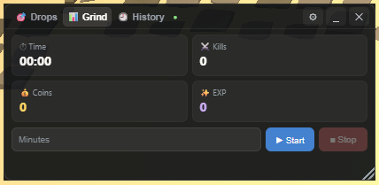
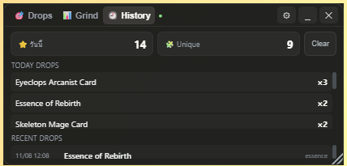

<div align="center">

# SpiritVale Drops Overlay

### Packet-based Rare Drop Overlay for SpiritVale

Lightweight • Portable • Sound Packs • Own Drop Detection

**Created by MrNexus**

---


</div>

---

# 🇹🇭 ภาษาไทย

## SpiritVale Drops Overlay คืออะไร?

SpiritVale Drops Overlay เป็นโปรแกรม Overlay สำหรับเกม **SpiritVale**
ที่ตรวจจับ Rare Drop จากข้อมูล Packet ของเกม และแจ้งเตือนผ่านเสียงแบบเรียลไทม์

โปรแกรมถูกออกแบบให้มีขนาดเล็ก ใช้งานง่าย และไม่ต้องติดตั้ง (Portable)

---

# ✨ คุณสมบัติ

- 🎯 ตรวจจับ Rare Drop จาก Packet
- 👤 ตรวจสอบว่าเป็น Drop ของตัวเอง (Own Drop Detection)
- 🔊 ระบบ Sound Pack
- 📊 Grind Tracker
- 🕒 History
- 💾 Profiles
- 🎨 Overlay โปร่งใส
- ⚡ Ctrl + Alt + O ซ่อน/แสดง Overlay
- 📦 Portable Build
- 📝 Runtime Logger

---

# 📷 ตัวอย่าง

## 📊 Grind Tracker and History

<p align="center">
  
  
</p>

---

# 🔒 ความปลอดภัย

Overlay นี้

✅ อ่านข้อมูล Packet เท่านั้น

Overlay นี้

❌ ไม่แก้ไขไฟล์เกม

❌ ไม่ Inject DLL

❌ ไม่ Hook Process

❌ ไม่แก้ Memory

❌ ไม่ส่ง Packet

❌ ไม่มีระบบ Bot

❌ ไม่มี Macro

โปรแกรมทำหน้าที่เพียงอ่านข้อมูล Network และแสดงผลบน Overlay เท่านั้น

---

# 📦 การติดตั้ง

## 1. ดาวน์โหลด Release ล่าสุด

ดาวน์โหลด

```
SpiritValeDropsOverlay-v1.0.0-win64.zip
```

จากหน้า

**Releases**

---

## 2. แตกไฟล์

เช่น

```
SpiritValeDropsOverlay/
```

---

## 3. ติดตั้ง Npcap

ดาวน์โหลดจาก

https://npcap.com

---

## 4. เปิดโปรแกรม

```
SpiritValeDropsOverlay.exe
```

จากนั้นเปิดเกม SpiritVale

---

# ⌨ Hotkey

```
Ctrl + Alt + O
```

ซ่อน / แสดง Overlay

> แม้ Overlay ถูกซ่อน การตรวจจับ Packet จะยังทำงานต่อ

---

# 🔊 Sound Pack

สามารถสร้าง Sound Pack ได้เอง

```
sounds/
└── packs/
```

หากไม่มีไฟล์เสียงบางไฟล์

ระบบจะใช้เสียงจาก Default โดยอัตโนมัติ

---

# 👤 Profiles

รองรับหลาย Profile เช่น

- Default
- Farming
- Raid
- Silent

แต่ละ Profile จะจำ

- Volume
- Opacity
- Sound Pack
- Sound Filter

แยกจากกัน

---

# 📁 โครงสร้างโฟลเดอร์

```
SpiritValeDropsOverlay/

├── bin/
├── sounds/
│   └── packs/
├── data/
│   ├── logs/
│   └── settings.json
└── SpiritValeDropsOverlay.exe
```

---

# 📝 Log

ไฟล์ Log จะอยู่ที่

```
data/logs/
```

ใช้สำหรับตรวจสอบปัญหา

---

# ❓ FAQ

### โปรแกรมแก้ไฟล์เกมหรือไม่?

ไม่

---

### โปรแกรมใช้ Memory Hack หรือไม่?

ไม่

---

### ต้องติดตั้งหรือไม่?

ไม่

เป็น Portable

---

### ต้องติดตั้งอะไรเพิ่มหรือไม่?

ต้องติดตั้ง

Npcap

---

### Sound Pack อยู่ที่ไหน?

```
sounds/packs/
```

---

# ❤️ สนับสนุนการพัฒนา

หากโปรแกรมนี้มีประโยชน์สำหรับคุณ
และต้องการสนับสนุนการพัฒนาต่อ

สามารถสนับสนุน **MrNexus**

> https://easydonate.app/mrnexus

---

# 🇺🇸 English

English documentation will be added soon.

---

# 📄 License

Copyright © 2026 **MrNexus**

All Rights Reserved.